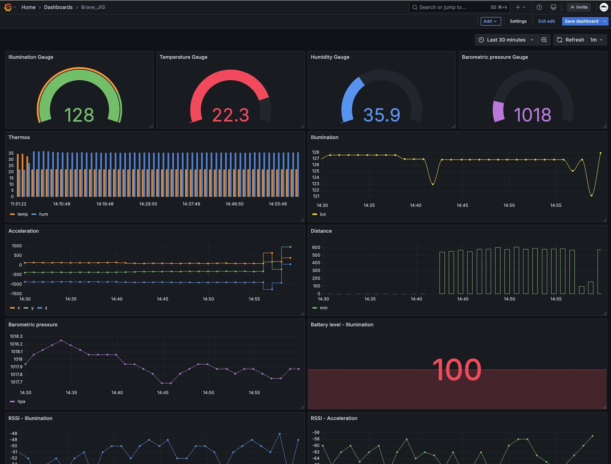

# BraveJIG helper

Braveridge社製[BraveJIG](https://jig.braveridge.com/)との連携を可能にするhelperです

Kraken　BraveJIG helperを利用することで、BraveJIGのセンサデータをデータベースに蓄積/可視化することが簡単にできます



BraveJIGデバイスの利用方法はBraveJIGの[各種ドキュメント](https://jig.braveridge.com/support/)を参照ください


# 接続方法

以下の手順でBraveJIGからのセンサーデータをKrakenで受信可能です。具体的なセットアップ手順は後述します

1. Krakenを搭載したコンピューターと[BraveJIG USBルーター](https://jig.braveridge.com/product/archives/5)をUSBケーブルで接続する
2. BraveJIG USBルーターを開始状態にする
3. Kraken collectorのselial collectorでUSBルーターからKraken Brokerにセンサーデータを送信する
4. [BraveJIG helper](https://github.com/bathtimefish/kraken_broker_python/tree/main/src/helpers/brave_jig)でデータをパースする

# 対応モジュール

現在、以下のBraveJIGモジュールに対応しています

- [照度モジュール](https://jig.braveridge.com/product/archives/6)
- [加速度モジュール](https://jig.braveridge.com/product/archives/7)
- [温湿度モジュール](https://jig.braveridge.com/product/archives/8)
- [測距モジュール](https://jig.braveridge.com/product/archives/9)
- [気圧モジュール](https://jig.braveridge.com/product/archives/10)

# Kraken Broker BraveJIG　helperを利用する

以下の手順でセットアップします

1. Krakenを搭載するコンピュータとBraveJIG USBルーターを接続する
2. BraveJIG USBルーターを開始状態にする
3. Kraken collector/brokerをセットアップする
2. Kraken collector serial collectorをセットアップする
3. BraveJIG helperを利用してBrokerをカスタムする

## Krakenを搭載するコンピュータとBraveJIG USBルーターを接続する

ここではKrakenを搭載するコンピュータをRaspberry Pi 4Bとして説明します。Krakenを搭載するコンピュータとBraveJIG USBルーターをUSBケーブルで接続します。正常に接続できた場合、`/dev/ttyACM0`等がBraveJIGになるでしょう

```shell
ls -alF /dev/ttyACM0
```

接続後、シリアル接続する場合の権限が足りない場合は適切な権限を設定してください

```shell
sudo chmod 0777 /dev/ttyACM0
sudo chown pi:pi /dev/ttyACM0
```

## Kraken collector/brokerをセットアップする

[Getting started](https://github.com/bathtimefish/kraken_broker_python/blob/main/README-ja.md#getting-started)を参考にKraken collecotor/brokerをセットアップします

## BraveJIG USBルーターを開始状態にする

初期状態のBraveJIG USBルーターは停止状態（センサーモジュールからデータを受信しない状態）となっています。USBルーターを開始状態にしてモジュールからデータをする状態にします。USBルーターの設定方法は[USBルーターのソフトウェア仕様書](https://jig.braveridge.com/support/developerdocumentation)を参照ください

USBルーターが開始状態になると、ルーターが受信するセンサーデータをUSBシリアル接続で受信できます

## Kraken collector serial collectorをセットアップする

collector用に以下の環境変数を設定してserial collectorを起動します

```shell
export KRKNC_SERIAL_DEVICE_NAME=brave_jig
export KRKNC_SERIAL_PORT=/dev/ttyACM0
export KRKNC_SERIAL_BAUDRATE=38400
export KRKNC_SERIAL_TIMEOUT_SEC=10
```

systemdでcollectorを起動する場合は[kraken_broker.env](https://github.com/bathtimefish/kraken_broker_python/blob/main/assets/kraken_broker.env)に以下を追加して`/etc/default/`に設置します

```kraken_broker.env
KRKNC_SERIAL_DEVICE_NAME=brave_jig
KRKNC_SERIAL_PORT=/dev/ttyACM0
KRKNC_SERIAL_BAUDRATE=38400
KRKNC_SERIAL_TIMEOUT_SEC=10
```

設定後、collectorを再起動します。collectorがDEBUGモードの場合、以下のようなログでserial collectorが起動したことを確認できます

```shell
Apr 1 11:11:11 krakenpi kraken_collector[397144]: [2025-04-01T11:11:11Z INFO  main] KRAKEN Collector -- The Highlevel Data Collector -- boot squence start.
Apr 1 11:11:11 krakenpi kraken_collector[397144]: [2025-04-01T11:11:11Z DEBUG main::service] starting serial collector service...
Apr 1 11:11:11 krakenpi kraken_collector[397144]: [2025-04-01T11:11:11Z DEBUG main::service] collector service started.
Apr 1 11:11:11 krakenpi kraken_collector[397144]: [2025-04-01T11:11:11Z DEBUG main::collectors::serial] Connecting to serial device on /dev/ttyACM0 at 38400 baud:
```

## BraveJIG helperを利用してBrokerをカスタムする

`src/brokers/brave_jig_broker.py`

```simple_broker.py
import logging
import json
from lib import kraken_pb2
from lib.broker import Broker
import helpers.brave_jig.main as brave_jig

logging.basicConfig(format='%(asctime)s %(message)s', level=logging.DEBUG)
logger = logging.getLogger(__name__)

class BraveJigBroker(Broker):

    def __init__(self):
        self.name = "BraveJigBroker"
    
    async def on(self, request: kraken_pb2.KrakenRequest, response: kraken_pb2.KrakenResponse) -> kraken_pb2.KrakenResponse|None:
        meta = json.loads(request.metadata)
        if request.collector_name == "serial" and meta["device_name"] == "brave_jig":
                data = brave_jig.parse(request.payload)
        logger.info("Sensor Data: %s" % json.dumps(data))
        response_content_type = "text/plain"
        response_meta = {
            "response_type": "simple"
        }
        meta_str = json.dumps(response_meta)

        response_content_type = "text/plain"
        response_meta = {
            "response_type": "simple"
        }
        meta_str = json.dumps(response_meta)
        kraken_response =  response(
            collector_name=request.collector_name,
            content_type=response_content_type,
            metadata=meta_str,
            payload=bytes([0x00])
        )
        return kraken_response
```

正常に実行された場合、以下のようなログが確認できます

```shell
Apr 1 11:11:11 krakenpi python[452]: 2025-04-01 11:11:11,111 Sensor data: {'protocol_ver': 1, 'type': 0, 'data_length': 12, 'unix_time': 1745033583, 'sensor_device_id': '1111111111111111', 'sensor_id': '0121', 'rssi': -44, 'order': 65535, 'battery_level': 100, 'sampling_interval': 0, 'sampling_time': 1745046982, 'sampling_num': 1, 'lux': 120.44445037841797}
```

## BraveJIG helper

### helperのインポート

```example.py
import helpers.brave_jig.main as brave_jig
```

### BraveJIG センサデータのパース

```example.py
if request.collector_name == "serial" and meta["device_name"] == "brave_jig":
    sensor_json = brave_jig.parse(request.payload)
logger.info("Sensor data: %s" % sensor_json)
```

`serial`collectorからのデータで、メタデータの`device_name`が`brave_jig`である場合のデータがBraveJIG USBルーターから受信したデータです。受信したペイロードを`brave_jig.parse()`でパースします

```example.py
sensor_json = brave_jig.parse(request.payload)
```

`brave_jig.parse()`は引数に指定したバイトデータをBraveJIG各センサモジュールのデータ仕様に基づいて自動的にパースしJSONオブジェクトとして返します

センサモジュールの種類はBraveJIGの仕様に基づいて`sensor_id`フィールドの値で識別可能です。例えば、照度センサ(`sensor_id` == `0121`)の照度のみを出力するには以下のようにできます

```example.py
if request.collector_name == "serial" and meta["device_name"] == "brave_jig":
    sensor_json = brave_jig.parse(request.payload)
if sensor_json["sensor_id"] == "0121":
    logger.info("Lux: %s" % sensor_json["lux"])
```

### 参考: BraveJIGのデータをクラウドサービスを使って可視化する

以下はBraveJIG照度モジュールの照度値を時系列データベースクラウドサービス[Influx Cloud](https://www.influxdata.com/products/influxdb-cloud/)にストアするためのサンプルコードです

```brave_jig_broker.py
import logging
import json
from lib import kraken_pb2
from lib.broker import Broker
from adapters.influxdb InfluxDbAdapter
import influxdb_client
import helpers.brave_jig.main as brave_jig
from influxdb_client_3 import InfluxDBClient3, Point, InfluxDBError, write_client_options, WriteOptions

logging.basicConfig(format='%(asctime)s %(message)s', level=logging.DEBUG)
logger = logging.getLogger(__name__)

class InfluxDB3WriteCallback(object):
    def __init__(self):
        None
    def success(self, conf, data: str):
        logger.debug(f"Written successfully, data: {data}")
    def error(self, conf, data: str, exception: InfluxDBError):
        logger.debug(f"Cannot write: {conf}, data: {data} due: {exception}")
    def retry(self, conf, data: str, exception: InfluxDBError):
        logger.debug(f"Retryable error occurs: {conf}, data: {data} retry: {exception}")

class BraveJigBroker(Broker):

    def __init__(self):
        self.name = "BraveJigBroker"
        self.influxdb = InfluxDbAdapter()
    
    async def on(self, request: kraken_pb2.KrakenRequest, response: kraken_pb2.KrakenResponse) -> kraken_pb2.KrakenResponse|None:
        meta = json.loads(request.metadata)
        if request.collector_name == "serial" and meta["device_name"] == "brave_jig":
                sensor_json = brave_jig.parse(request.payload)
        logger.info("Sensor data: %s" % sensor_json)

        try:
            # Write timeseries data to InfluxDB v3
            write_options = WriteOptions(
                batch_size=100,
                flush_interval=10_000,
                jitter_interval=2_000,
                retry_interval=5_000,
                max_retries=5,
                max_retry_delay=30_000,
                exponential_base=2
            )
            callback = InfluxDB3WriteCallback()
            write_opt = write_client_options(
                success=callback.success,
                error_callback=callback.error,
                retry_callback=callback.retry,
                write_options=write_options
            )
            client = InfluxDBClient3(
                host="[YOUR_INFLUX_CLOUD_HOST_URL]",
                token="[YOUR_ACCESS_TOKEN]",
                org="default",
                database="brave_jig",
                write_client_options=write_opt
            )
            point = None
            if sensor_json["sensor_id"] == "0121":
                point = Point("illum_sensor") \
                        .field("lux", sensor_json["lux"]) \
                        .field("rssi", sensor_json["rssi"]) \
                        .field("battery_level", sensor_json["battery_level"]) \
                        .tag("sensor_device_id", sensor_json["sensor_device_id"]) \
                        .tag("sensor_id", sensor_json["sensor_id"])
            if point is not None:
                client.write(point)
                client.close()

        except Exception as e:
            logger.error(e)

        response_content_type = "text/plain"
        response_meta = {
            "response_type": "simple"
        }
        meta_str = json.dumps(response_meta)
        kraken_response =  response(
            collector_name=request.collector_name,
            content_type=response_content_type,
            metadata=meta_str,
            payload=bytes([0x00])
        )
        return kraken_response
```

Influx Cloudと[Grafana Cloud](https://grafana.com/)を連携することでBraveJIGのセンサーデータをダッシュボードで可視化することができます
